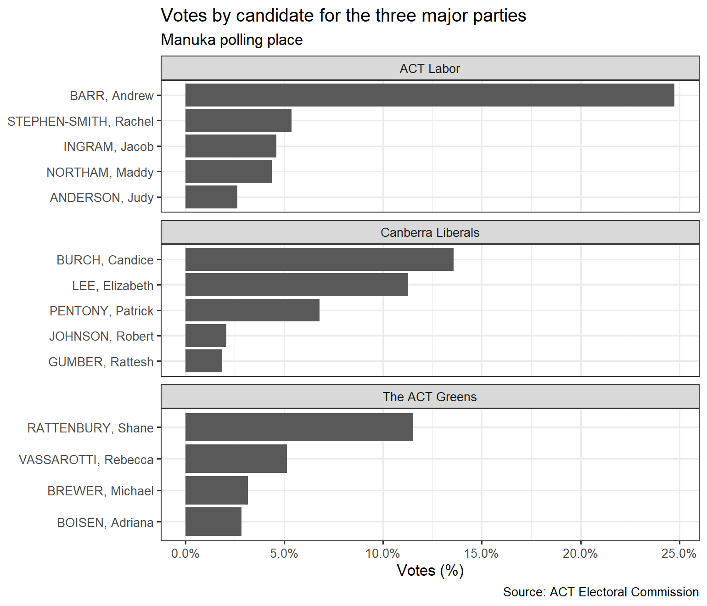

<!-- README.md is generated from README.Rmd. Please edit that file -->

# actvotes

<!-- badges: start -->

[](https://github.com/bryceroney/actvotes/actions)
<!-- badges: end -->

This package provides tidy datasets of ACT territory election results.

## Installation

You can install the development version from
[GitHub](https://github.com/) with:

``` r
# install.packages("devtools")
devtools::install_github("bryceroney/actvotes")
```

## Datasets

This package currently contains the following datasets from the [ACT
Electoral Commission](https://www.elections.act.gov.au):

  - 2020 Election: Polling Places (`act_polling_places_2020`),
    Candidates (`act_candidates_2020`), First Preference (`act_fp_2020`)
    results and final preference distribution (`act_preferences_2020`).

## Usage Example

``` r

act_fp_2020 %>%
  inner_join(act_candidates_2020, by=c("candidate"="ballot_paper_name")) %>%
  filter(polling_place == 'Manuka' & electorate == 'Kurrajong' &
           party %in% c('ACT Labor', 'Canberra Liberals', 'The ACT Greens')) %>%
  mutate(candidate = reorder(candidate, votes),
         votes = votes/sum(votes)) %>%
  ggplot(aes(x=candidate, y=votes)) +
  geom_col() +
  coord_flip() +
  scale_y_continuous(labels = scales::percent_format()) +
  facet_wrap(~party, scales='free_y', ncol=1) +
  labs(
    title = 'Votes by candidate for the three major parties',
    subtitle = 'Manuka polling place',
    y = 'Votes (%)',
    x = NULL,
    caption = 'Source: ACT Electoral Commission'
  ) +
  theme_bw()
```


